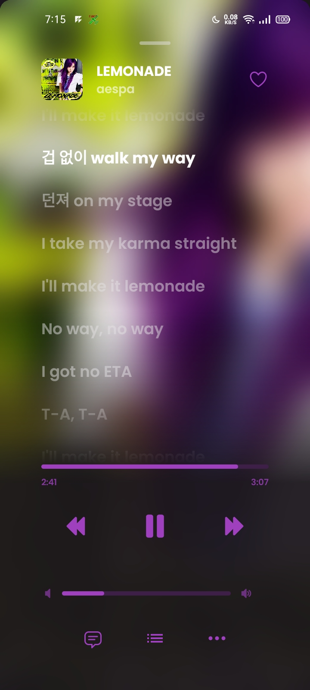
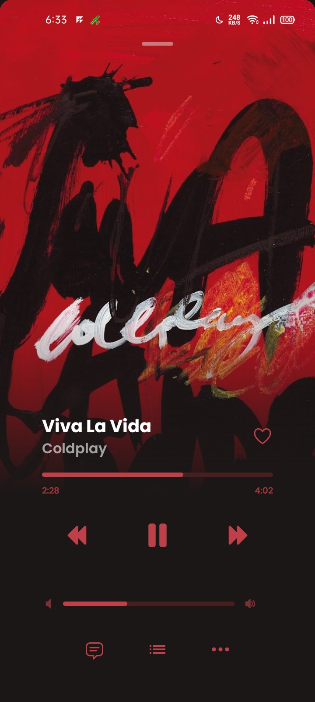

<div align="center">
    
    <br/>
    <h1>🎶 VMusic</h1>
    <p><b>A modern, beautiful, and lightweight music streaming client for Android.</b></p>

[](https://github.com/yashrajrocxx/VMusic/releases/latest)
[](LICENSE)
[-orange?style=for-the-badge&logo=android)](https://developer.android.com)
[](https://github.com/yashrajrocxx/VMusic/releases/latest)
</div>

---

## ✨ Features

- 🎧 **Endless Streaming** — Stream almost any track, album, artist, or video from YouTube Music.
- 📱 **Local Media Playback** — Play your on-device audio files seamlessly.
- 🔄 **Background & Offline Playback** — Listen with your screen off, and cache songs for offline listening.
- 📜 **Time-synced Lyrics** — Real-time synchronized and plain lyrics fetched via [LRCLIB](https://lrclib.net) & [KuGou](https://kugou.com).
- 🔍 **Rich Discovery & Search** — Search tracks, albums, artists, and playlists or explore curated moods and genres.
- 🎨 **Material You & AMOLED** — Dynamic color palettes with Monet, Material You, pure black AMOLED mode, and custom accent colors.
- 🚗 **Android Auto** — Drive safely with full Android Auto vehicle media integration.
- 🔊 **Audio Engineering** — Built-in loudness normalization, customizable equalizer, bass boost, and silence skipping.
- 📦 **Optimized Native Architecture** — Independent **ARM64** (`arm64-v8a`) and **32-bit ARM** (`armeabi-v7a`) builds ensure the fastest startup and minimum APK size.
- 🔗 **Smart Deep Linking** — Open YouTube and YouTube Music links (`watch`, `playlist`, `channel`) straight in VMusic.
- 🛡️ **Privacy-First** — No ads, no telemetry, no tracking, and open source.

---

## 📸 Screenshots

<details>
  <summary><b>Click to expand screenshots</b></summary>
  <br/>
  <div align="center">
    
    
    
    <br/><br/>
    
    
    
  </div>
</details>

---

## 📥 Download & Installation

Get the latest stable release directly from the GitHub Releases page:

<div align="center">
  <a href="https://github.com/yashrajrocxx/VMusic/releases/latest">
    
  </a>
</div>

<br/>

### Which APK should you choose?

- **`vmusic-*-arm64-v8a.apk`** *(Recommended)*: For all modern Android devices (64-bit ARM). Faster and smaller download size.
- **`vmusic-*-armeabi-v7a.apk`**: For older 32-bit Android smartphones and legacy devices.

---

## 🛠️ Building From Source

### Prerequisites
- **JDK 21** (Temurin 21 recommended)
- **Android SDK Platform API 36 / 37** and **Build-Tools 35.0.0 / 36.0.0**
- Environment variables: `JAVA_HOME` and `ANDROID_HOME`

### Compile Command
```bash
# Clone the repository
git clone https://github.com/yashrajrocxx/VMusic.git
cd VMusic

# Build Debug APKs for both ARM64 and ARM32
./gradlew :app:assembleDebug --no-configuration-cache

# Build Release APKs
./gradlew :app:assembleRelease --no-configuration-cache
```
*Built APKs will be located in `app/build/outputs/apk/release/`.*

---

## 💖 Acknowledgments

VMusic is made possible thanks to these wonderful open-source projects:
- [**ViMusic**](https://github.com/vfsfitvnm/ViMusic) & [**ViTune**](https://github.com/bartoostveen/ViTune): The foundational music client architecture and inspiration.
- [**InnerTune**](https://github.com/z-huang/InnerTune) & [**MetroList**](https://github.com/mostafa-a-elhariry/metrolist): Core UI components and concepts.
- [**YouTube-Internal-Clients**](https://github.com/zerodytrash/YouTube-Internal-Clients): YouTube API exploration and client endpoints.
- [**LRCLIB**](https://lrclib.net) & [**KuGou**](https://kugou.com): Synchronized lyrics and metadata providers.
- [**ionicons**](https://github.com/ionic-team/ionicons): Beautiful crafted vector icons.

---

## ⚖️ Disclaimer

VMusic is an open-source project intended for personal use and educational research.
This project and its contributors are not affiliated with, authorized, maintained, sponsored, or endorsed by YouTube, Google LLC, or any of their affiliates or subsidiaries. All product and company names are trademarks™ or registered® trademarks of their respective holders.
